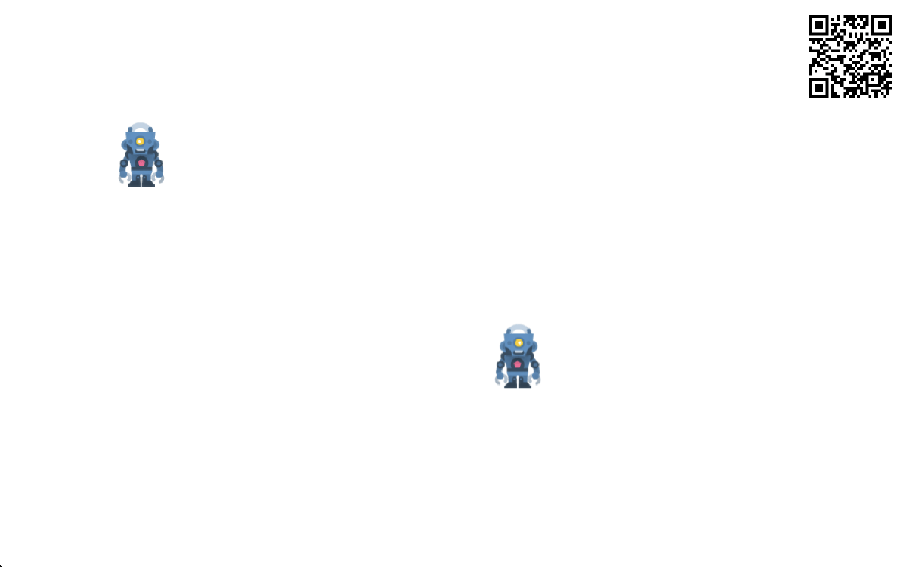
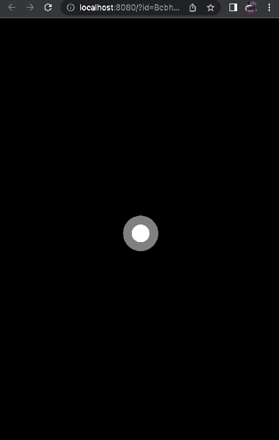

# alexa-phaser-colyseus

*Code is provided as-is*

[View Demo Here](https://alexa-phaser-colyseus-demo.herokuapp.com)

## How to use
Clone this repo
```
git clone git@github.com:ianvo/alexa-phaser-colyseus.git
```
For convenience purposes, this repo runs both the Client (Phaser + Colyseus client + Alexa WebAPI) and the Server (Node.js + Colyseus server + ASK) out of a single server instance. You'd probably want to separate this out if you were deploying this for real.

```
cd alexa-phaser-colyseus
npm install
```
The dev script is setup with Nodemon to automatically restart the server whenever you modify your code.
```
npm run dev
```
You can then access [http://localhost:8080](http://localhost:8080) on your desktop browser to view the main client (you can try it in multiple windows to load up multiple players simultaneously). You can tap to move your robot around, and you can tap on the QR code to make it larger. Scanning the QR code might not make sense because your phone won't be able to connect to the same localhost, but you can check the console output to see a URL (that will look something like `http//localhost:8080?id=abcd1234`). You can load that URL in another window to function as your controller. 

| Main Client | Controller |
| - | - |
|  |  |

## How it works
The general overview is:
1. User starts the game on their main device, and the server creates a new Player instance for them
2. The server tells the Player ID to the main device, which then encodes it into the QR Code
3. The user scans the QR Code to load a controller UI on their mobile phone. When the controller connects to the server, it is able to provide the Player ID from the QR Code
4. The server now processes inputs from that controller on behalf of the Player.

## Deploying an Alexa Skill
If you're using this code as is (i.e. running everything out of a single server), once you have the server running on some publicly available endpoint, you'll need to update `index.js` in the root folder to whatever your URL is, e.g.
```
[Line 11] const WEB_APP_URL = "https://alexa-phaser-colyseus-demo.herokuapp.com/";
```
In the ASK Developer Console, you can then create a new skill with a self-hosted Node.js, and point your endpoint to the same URL.

You will also need to make sure that you've enabled the `Alexa Web API for Games` in the `Interfaces` tab

## Documentation

- [Phaser](https://photonstorm.github.io/phaser3-docs/index.html)
- [Colyseus](https://docs.colyseus.io/)
- [Alexa WebAPI](https://developer.amazon.com/en-US/docs/alexa/web-api-for-games/alexa-games-about.html)
- [Alexa Skills Kit](https://developer.amazon.com/en-US/alexa/alexa-skills-kit)

## Assets
All Assets are from [Kenney.nl](https://www.kenney.nl/)

## License

MIT License
